# Graph algorithm visualization for debugging competitive programming tasks

This Visual Studio extension was developed as an additional debugging tool for graph algorithms in competitive programming problems. It takes a description of a graph config from the user and renders a graph. The graph is redrawn every time when the debugger's context is changed. 

## Getting started

### Prerequisites

You will need Visual Studio 2017 (the tool was tested on Visual Studio Community 2017 15.9.5) and Visual C++ installed (the extension should work on .NET projects as well, but it was designed for and tested on C++ projects).

### Installation

To install the extension download the VSIX file from the latest release here <https://github.com/olgalupuleac/GraphAlgorithmRenderer/releases> . Click on the downloaded file and follow the instructions. To open a graph visualization setting window select *View > Other windows > Graph visualization.*

## Basic sample

Let's consider a simple problem <https://www.hackerearth.com/ru/practice/algorithms/graphs/depth-first-search/practice-problems/algorithm/monk-and-graph-problem/>

The code of the possible solution is provided below. We will use a depth-first search to find a component which every vertex belongs to. We also count the number of edges for each component, skipping edges which have been visited.

```c++
#include <iostream>
#include <vector>
#include <algorithm>

using namespace std;

const int N = int(1e5);

struct edge
{
	int id;
	int to;
};

vector<edge> g[N];
int vertex_component[N];
int components_size[N];
bool used_vertexes[N];
bool used_edges[N];

int n, m;
int cur_component;

void dfs(int v)
{
	used_vertexes[v] = true;
	vertex_component[v] = cur_component;
	for (int i = 0; i < g[v].size(); i++)
	{
		if (used_edges[g[v][i].id]) 
		{
			continue;
		}
		components_size[cur_component]++;
		used_edges[g[v][i].id] = true;
		int u = g[v][i].to;
		if (used_vertexes[u])
		{
			continue;
		}
		dfs(u);
	}
}

int main()
{
	cout.sync_with_stdio(0);
	cin >> n >> m;
	for (int i = 0; i < m; i++)
	{
		int a, b;
		cin >> a >> b;
		g[a - 1].push_back({ i, b - 1 });
        // Checking (a != b) to avoid duplication of edges in config.
        // It could be also achieved through
        // following validation expression
        // "__a__ < g[__a__][__x__].to || __a__ == g[__a__][__x__].to
        // && __x__ % 2 == 0"
        // but it seems slightly easier to do it in this way and use 
        // this validation expression: "__a__ <= g[__a__][__x__].to"
		if (a != b) 
		{
			g[b - 1].push_back({ i , a - 1 });
		}
	}
	fill(vertex_component, vertex_component + n, -1);
	for (int i = 0; i < n; i++)
	{
		if(!used_vertexes[i])
		{
			dfs(i);
			cur_component++;
		}
	}
	cout << *max_element(components_size, components_size + cur_component) << endl;
	return 0;
}
```


Now, let's visualize this code. Assume we have the following input:

~~~~
9 12
1 2
4 2
3 4
3 4
2 4
2 2
2 3
5 9
9 8
7 8
7 6
5 6
~~~~

First, we want to specify the nodes. We can have several families of nodes and edges. For this particular problem, we will only need one node family and one edge family. To add a new node family click *Add* under the list with nodes.

 

The window with node family settings opens automatically. The default family names are *node#0, node#1* and so on, but you can specify your own.


Now, let's describe the node family. First, every graph element (node or edge) should be identified by family name and a named tuple of integers. Each element in the tuple (let's call it index) has a range described by begin template and end template. To refer to a certain index in any expression, use \_\_*index_name*\_\_ (e.g. `__v__`).  Begin template and end templates must be expressions, which could be evaluated to integers using the debugger. Begin template and end template may contain a reference to previous indices (see edge family config). The index takes on all values in range `[begin; end)`. Validation template is used to filter identifiers. After substitution of indices (and function name and arguments) it should become an expression, which could be cast to bool. If the validation template is empty, all identifiers are valid.

So, in our example, we have one node family with the name *node#0* and one index in its identifier named *v*. Begin template is `0` and end template is `n`, which equals 9, so the nodes will be `node#0 v 0, node#0 v 1, ..., node#0 v 8`.

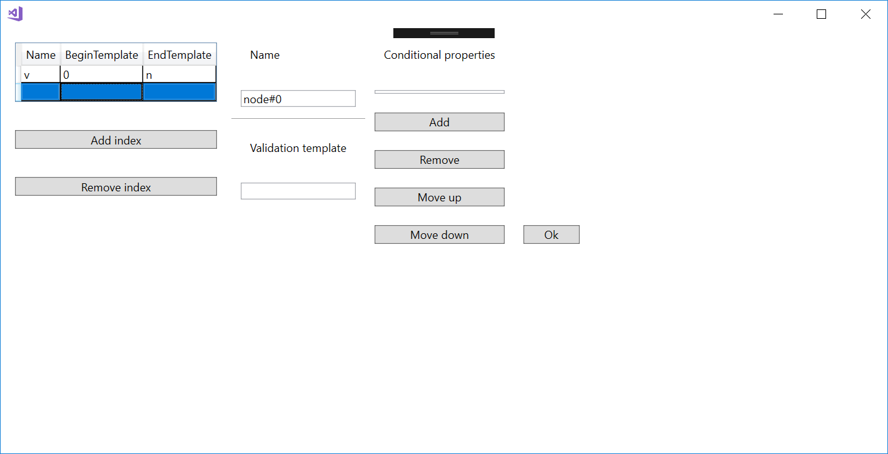

Now let's take a look at the edge family config. It's almost identical to the node config. First, we will set indices. There is an edge between `a` and `b` if there is `x` such that `g[a][x] == b`.
So, our indices will be `a` and `x`. Note that we use a previous index to define a range of `x`.

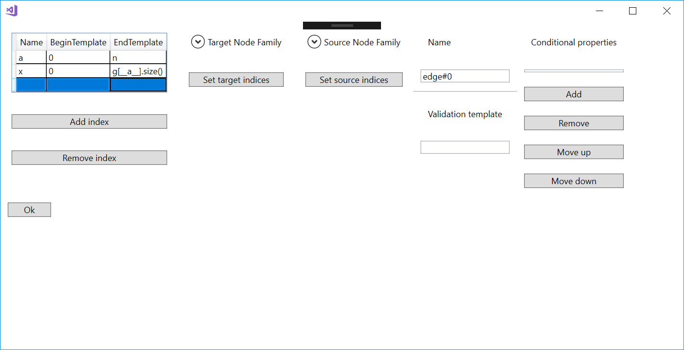

The difference between node family and edge family is that the edge family should contain a definition of its target and source nodes. As we can have several node families, we need to choose which families target and source belong to. (Note that they can belong to different families.) After choosing the family, we need to define how we will get the indices of the corresponding node.

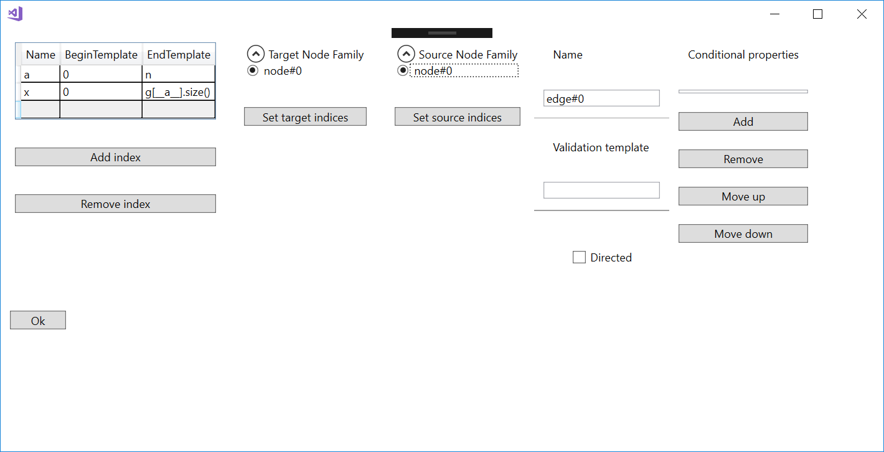

So, we can get the target using this expression.

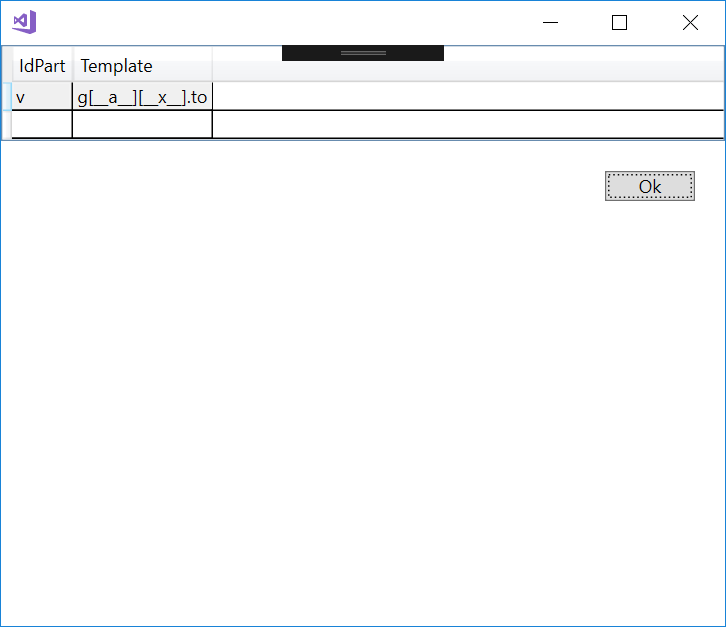

And the source is the first identifier index.

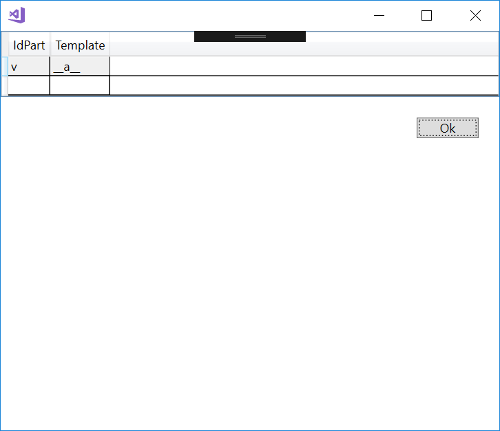

Finally, to avoid duplication of edges, we will specify the validation expression. Any expression in our setting is a valid C++ expression with placeholders for indices, such as `__a__` and `__x__`. However, the C++ Standard Library functions such as `std::find` are not allowed. You can implement your own function which calls `std::find`, but it will significantly increase execution time. Methods of `std` classes are also not allowed (that means storing graph as an array of unordered_sets would not work).

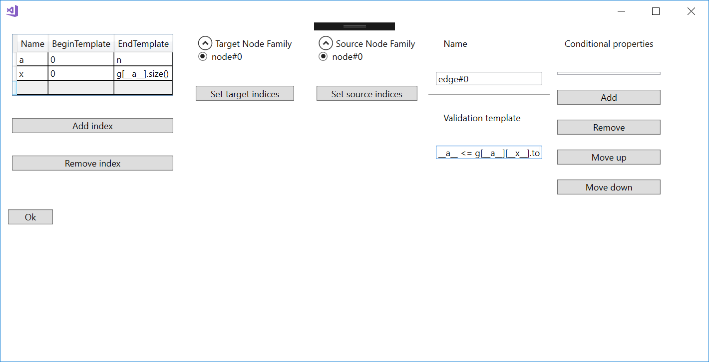


Now, let's generate our config and see how it looks like.


As we can see, the graph is rendered correctly, but the node labels may seem confusing. To avoid it, let's add some *Conditional properties* to our config.

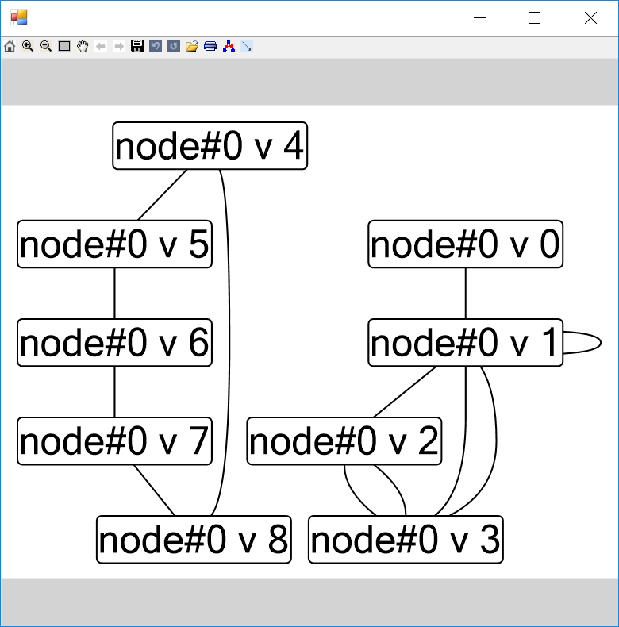

To add a conditional property, press *Add* under the list with conditional properties. Each conditional property has *Condition* (an expression with placeholders for indices, function name and function arguments), *Function regex* (to fulfill the condition, a function name should match this regular expression) and *Mode* (*Current stackframe*, *All stackframes*, *All stackframes (args only)*). If mode is set to *Current stackframe* the condition is checked only in the current stack frame. If set to *All stackframes*, the condition is fulfilled if it's fulfilled on one of the stack frames in the call stack (note this option works rather slowly). Finally, if mode set to *All stackframes (args only)*, we iterate other stack frames, check if function name in the stack frame matches the regex, substitute function name, function arguments, and indices and evaluate the expression in **the current stack frame**.  

To specify a label, we will use the same syntax as we used for all expressions, but these expressions will be surrounded by the additional placeholders `{}`. 

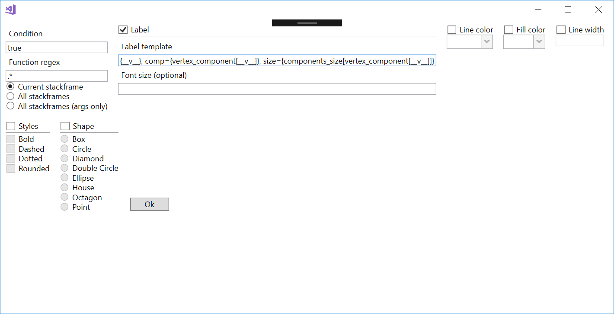Each conditional property may have multiple properties inside, but they must have a different kind (except styles). However,  different conditional properties may have properties with the same kind and there can be a graph element which fulfills both conditions. In this case, the first property will be applied.

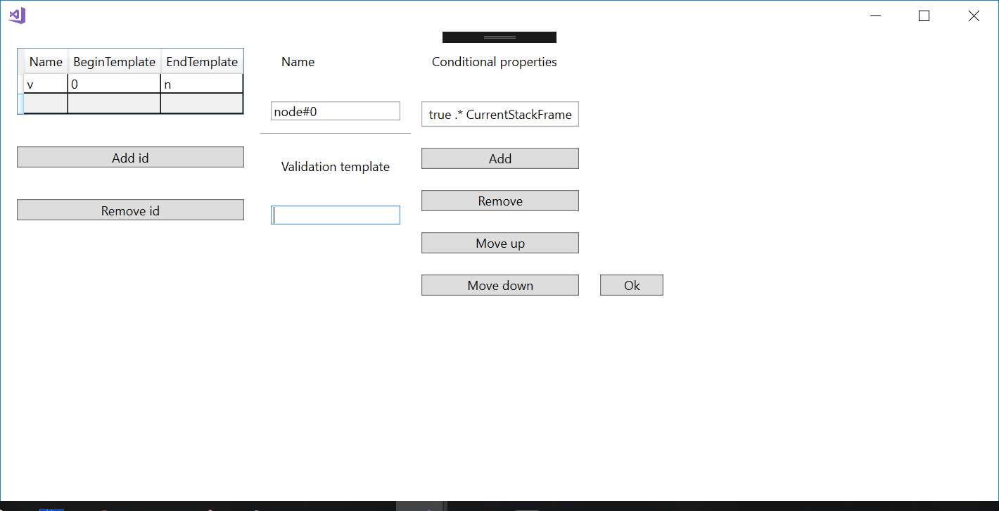

After adding a label to nodes, our picture improved. 


Now let's add other node properties. 

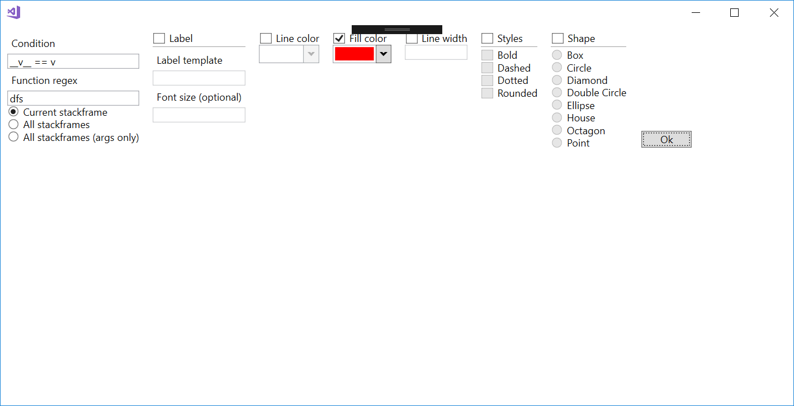

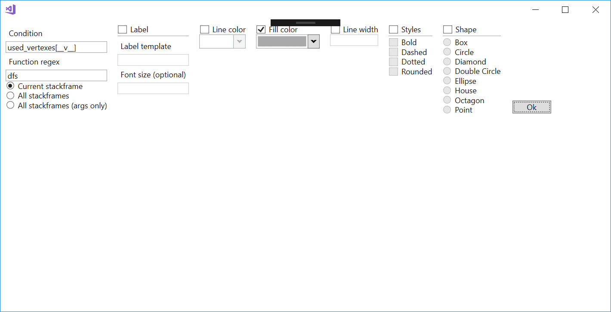

Edge properties...

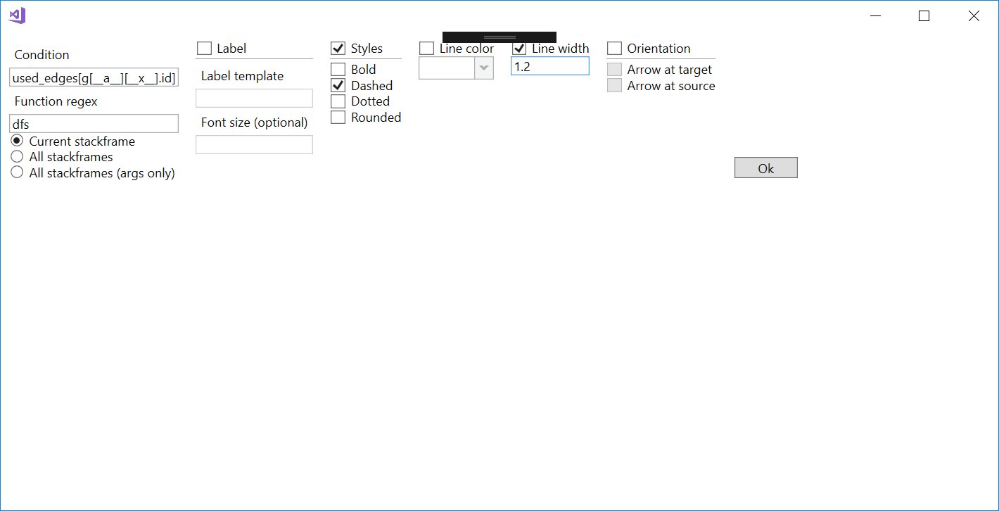

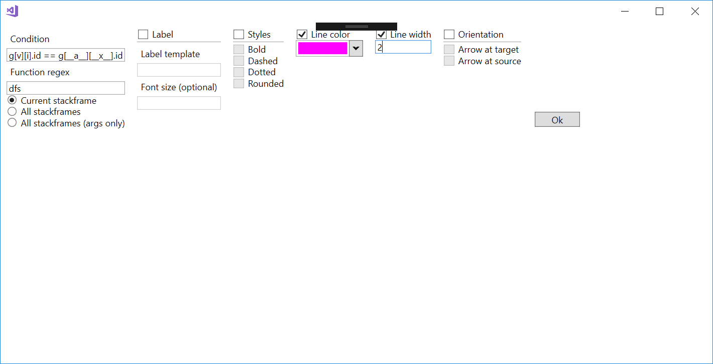


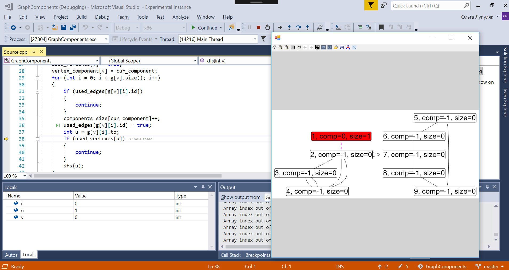

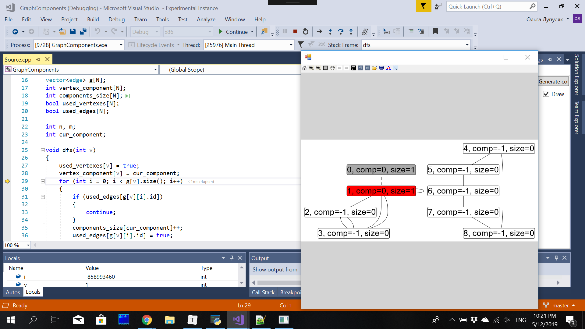


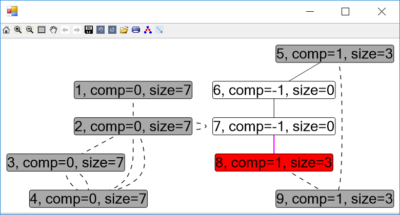

Finally, we can export the generated config in JSON, save it somewhere, and load it next time to avoid creating this config from the beginning. 

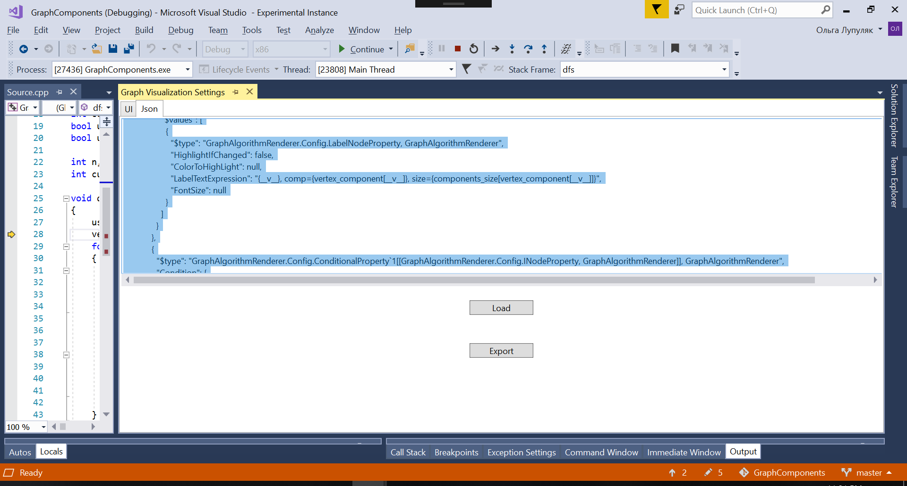

This the config for this problem.

```json
{
  "$type": "GraphAlgorithmRenderer.Config.GraphConfig, GraphAlgorithmRenderer",
  "Edges": {
    "$type": "System.Collections.Generic.List`1[[GraphAlgorithmRenderer.Config.EdgeFamily, GraphAlgorithmRenderer]], mscorlib",
    "$values": [
      {
        "$type": "GraphAlgorithmRenderer.Config.EdgeFamily, GraphAlgorithmRenderer",
        "Source": {
          "$type": "GraphAlgorithmRenderer.Config.EdgeFamily+EdgeEnd, GraphAlgorithmRenderer",
          "NodeFamilyName": "node#0",
          "NamesWithTemplates": {
            "$type": "System.Collections.Generic.Dictionary`2[[System.String, mscorlib],[System.String, mscorlib]], mscorlib",
            "v": "__a__"
          }
        },
        "Target": {
          "$type": "GraphAlgorithmRenderer.Config.EdgeFamily+EdgeEnd, GraphAlgorithmRenderer",
          "NodeFamilyName": "node#0",
          "NamesWithTemplates": {
            "$type": "System.Collections.Generic.Dictionary`2[[System.String, mscorlib],[System.String, mscorlib]], mscorlib",
            "v": "g[__a__][__x__].to"
          }
        },
        "Name": "edge#0",
        "Ranges": {
          "$type": "System.Collections.Generic.List`1[[GraphAlgorithmRenderer.Config.IdentifierPartTemplate, GraphAlgorithmRenderer]], mscorlib",
          "$values": [
            {
              "$type": "GraphAlgorithmRenderer.Config.IdentifierPartTemplate, GraphAlgorithmRenderer",
              "Name": "a",
              "BeginTemplate": "0",
              "EndTemplate": "n"
            },
            {
              "$type": "GraphAlgorithmRenderer.Config.IdentifierPartTemplate, GraphAlgorithmRenderer",
              "Name": "x",
              "BeginTemplate": "0",
              "EndTemplate": "g[__a__].size()"
            }
          ]
        },
        "ValidationTemplate": "__a__ <= g[__a__][__x__].to",
        "ConditionalProperties": {
          "$type": "System.Collections.Generic.List`1[[GraphAlgorithmRenderer.Config.ConditionalProperty`1[[GraphAlgorithmRenderer.Config.IEdgeProperty, GraphAlgorithmRenderer]], GraphAlgorithmRenderer]], mscorlib",
          "$values": [
            {
              "$type": "GraphAlgorithmRenderer.Config.ConditionalProperty`1[[GraphAlgorithmRenderer.Config.IEdgeProperty, GraphAlgorithmRenderer]], GraphAlgorithmRenderer",
              "Condition": {
                "$type": "GraphAlgorithmRenderer.Config.Condition, GraphAlgorithmRenderer",
                "Template": "used_edges[g[__a__][__x__].id]",
                "Mode": 0,
                "FunctionNameRegex": "dfs"
              },
              "Properties": {
                "$type": "System.Collections.Generic.List`1[[GraphAlgorithmRenderer.Config.IEdgeProperty, GraphAlgorithmRenderer]], mscorlib",
                "$values": [
                  {
                    "$type": "GraphAlgorithmRenderer.Config.LineWidthEdgeProperty, GraphAlgorithmRenderer",
                    "LineWidth": 1.2000000476837158
                  },
                  {
                    "$type": "GraphAlgorithmRenderer.Config.StyleEdgeProperty, GraphAlgorithmRenderer",
                    "Style": 1
                  }
                ]
              }
            },
            {
              "$type": "GraphAlgorithmRenderer.Config.ConditionalProperty`1[[GraphAlgorithmRenderer.Config.IEdgeProperty, GraphAlgorithmRenderer]], GraphAlgorithmRenderer",
              "Condition": {
                "$type": "GraphAlgorithmRenderer.Config.Condition, GraphAlgorithmRenderer",
                "Template": "g[v][i].id == g[__a__][__x__].id",
                "Mode": 0,
                "FunctionNameRegex": "dfs"
              },
              "Properties": {
                "$type": "System.Collections.Generic.List`1[[GraphAlgorithmRenderer.Config.IEdgeProperty, GraphAlgorithmRenderer]], mscorlib",
                "$values": [
                  {
                    "$type": "GraphAlgorithmRenderer.Config.LineColorEdgeProperty, GraphAlgorithmRenderer",
                    "Color": {
                      "$type": "Microsoft.Msagl.Drawing.Color, Microsoft.Msagl.Drawing",
                      "A": 255,
                      "R": 255,
                      "G": 0,
                      "B": 255
                    }
                  },
                  {
                    "$type": "GraphAlgorithmRenderer.Config.LineWidthEdgeProperty, GraphAlgorithmRenderer",
                    "LineWidth": 2.0
                  }
                ]
              }
            }
          ]
        }
      }
    ]
  },
  "Nodes": {
    "$type": "System.Collections.Generic.List`1[[GraphAlgorithmRenderer.Config.NodeFamily, GraphAlgorithmRenderer]], mscorlib",
    "$values": [
      {
        "$type": "GraphAlgorithmRenderer.Config.NodeFamily, GraphAlgorithmRenderer",
        "Name": "node#0",
        "Ranges": {
          "$type": "System.Collections.Generic.List`1[[GraphAlgorithmRenderer.Config.IdentifierPartTemplate, GraphAlgorithmRenderer]], mscorlib",
          "$values": [
            {
              "$type": "GraphAlgorithmRenderer.Config.IdentifierPartTemplate, GraphAlgorithmRenderer",
              "Name": "v",
              "BeginTemplate": "0",
              "EndTemplate": "n"
            }
          ]
        },
        "ValidationTemplate": "",
        "ConditionalProperties": {
          "$type": "System.Collections.Generic.List`1[[GraphAlgorithmRenderer.Config.ConditionalProperty`1[[GraphAlgorithmRenderer.Config.INodeProperty, GraphAlgorithmRenderer]], GraphAlgorithmRenderer]], mscorlib",
          "$values": [
            {
              "$type": "GraphAlgorithmRenderer.Config.ConditionalProperty`1[[GraphAlgorithmRenderer.Config.INodeProperty, GraphAlgorithmRenderer]], GraphAlgorithmRenderer",
              "Condition": {
                "$type": "GraphAlgorithmRenderer.Config.Condition, GraphAlgorithmRenderer",
                "Template": "true",
                "Mode": 0,
                "FunctionNameRegex": ".*"
              },
              "Properties": {
                "$type": "System.Collections.Generic.List`1[[GraphAlgorithmRenderer.Config.INodeProperty, GraphAlgorithmRenderer]], mscorlib",
                "$values": [
                  {
                    "$type": "GraphAlgorithmRenderer.Config.LabelNodeProperty, GraphAlgorithmRenderer",
                    "HighlightIfChanged": false,
                    "ColorToHighLight": null,
                    "LabelTextExpression": "{__v__}, comp={vertex_component[__v__]}, size={components_size[vertex_component[__v__]]}",
                    "FontSize": null
                  }
                ]
              }
            },
            {
              "$type": "GraphAlgorithmRenderer.Config.ConditionalProperty`1[[GraphAlgorithmRenderer.Config.INodeProperty, GraphAlgorithmRenderer]], GraphAlgorithmRenderer",
              "Condition": {
                "$type": "GraphAlgorithmRenderer.Config.Condition, GraphAlgorithmRenderer",
                "Template": "__v__ == v",
                "Mode": 0,
                "FunctionNameRegex": "dfs"
              },
              "Properties": {
                "$type": "System.Collections.Generic.List`1[[GraphAlgorithmRenderer.Config.INodeProperty, GraphAlgorithmRenderer]], mscorlib",
                "$values": [
                  {
                    "$type": "GraphAlgorithmRenderer.Config.FillColorNodeProperty, GraphAlgorithmRenderer",
                    "Color": {
                      "$type": "Microsoft.Msagl.Drawing.Color, Microsoft.Msagl.Drawing",
                      "A": 255,
                      "R": 255,
                      "G": 0,
                      "B": 0
                    }
                  }
                ]
              }
            },
            {
              "$type": "GraphAlgorithmRenderer.Config.ConditionalProperty`1[[GraphAlgorithmRenderer.Config.INodeProperty, GraphAlgorithmRenderer]], GraphAlgorithmRenderer",
              "Condition": {
                "$type": "GraphAlgorithmRenderer.Config.Condition, GraphAlgorithmRenderer",
                "Template": "used_vertexes[__v__]",
                "Mode": 0,
                "FunctionNameRegex": "dfs"
              },
              "Properties": {
                "$type": "System.Collections.Generic.List`1[[GraphAlgorithmRenderer.Config.INodeProperty, GraphAlgorithmRenderer]], mscorlib",
                "$values": [
                  {
                    "$type": "GraphAlgorithmRenderer.Config.FillColorNodeProperty, GraphAlgorithmRenderer",
                    "Color": {
                      "$type": "Microsoft.Msagl.Drawing.Color, Microsoft.Msagl.Drawing",
                      "A": 255,
                      "R": 169,
                      "G": 169,
                      "B": 169
                    }
                  }
                ]
              }
            }
          ]
        }
      }
    ]
  }
}
```

