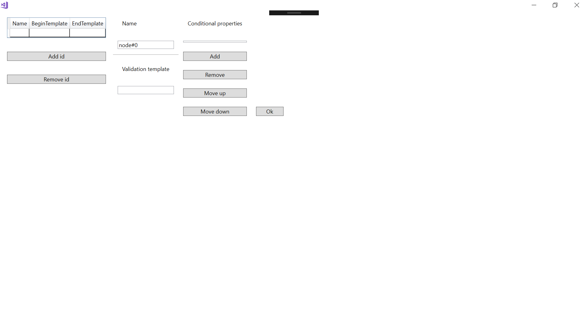
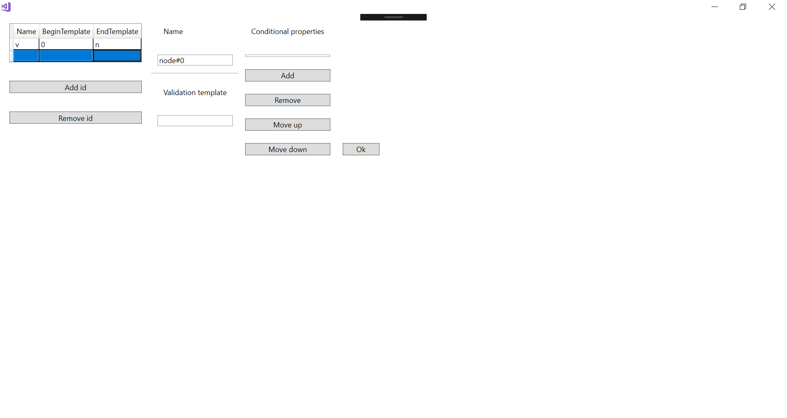
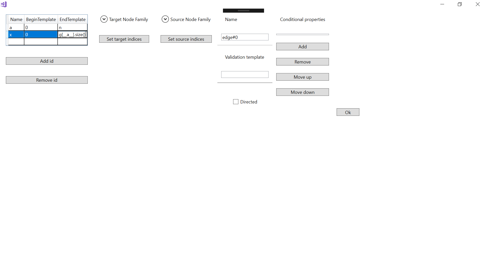
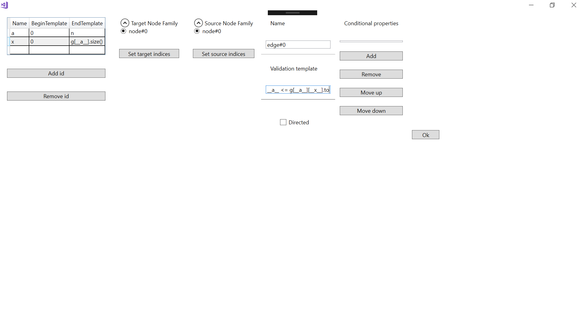
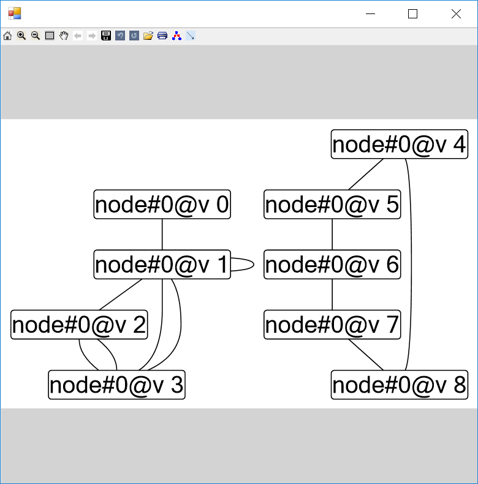
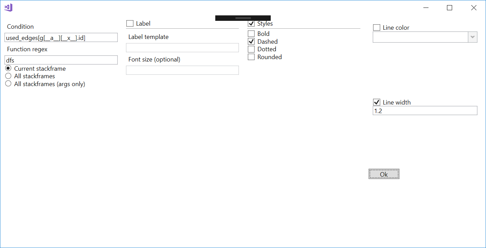
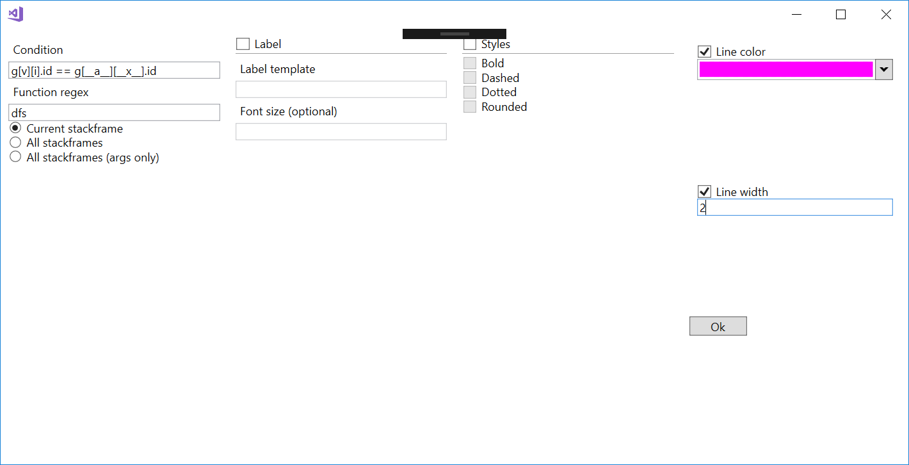

# Graph algorithm visualization to debug competitive programming tasks.

This Visual Studio extension was developed as an additional debugging tool for graph algorithms in competitive programming problems. It takes a description of a graph config from the user and renders a graph. The graph is redrawn every time when the debugger's context is changed. 

## Getting started

### Prerequisites

You will need Visual Studio 2017 (Visual Studio Community 2017 15.9.5 is recommended) and Visual C++ installed (the extension should work on .NET projects as well, but it was designed for and tested on C++ projects).

### Installation

To install the extension download the VSIX file from the latest release here <https://github.com/olgalupuleac/GraphAlgorithmRenderer/releases> . Click on the downloaded file and follow the instructions. To open a graph visualization setting window press *View > Other windows > Graph visualization.*

### Basic sample

Let's consider a simple problem <https://www.hackerearth.com/ru/practice/algorithms/graphs/depth-first-search/practice-problems/algorithm/monk-and-graph-problem/>

The code of the possible solution is provided below. We will use a depth-first search to find a component which every vertex belongs to. We also count the number of edges for each component, skipping edges which have been visited.

```c++
#include <iostream>
#include <vector>
#include <algorithm>

using namespace std;

const int N = int(1e5);

struct edge
{
	int id;
	int to;
};

vector<edge> g[N];
int vertex_component[N];
int components_size[N];
bool used_vertexes[N];
bool used_edges[N];

int n, m;
int cur_component;

void dfs(int v)
{
	used_vertexes[v] = true;
	vertex_component[v] = cur_component;
	for (int i = 0; i < g[v].size(); i++)
	{
		if (used_edges[g[v][i].id]) 
		{
			continue;
		}
		components_size[cur_component]++;
		used_edges[g[v][i].id] = true;
		int u = g[v][i].to;
		if (used_vertexes[u])
		{
			continue;
		}
		dfs(u);
	}
}

int main()
{
	cout.sync_with_stdio(0);
	cin >> n >> m;
	for (int i = 0; i < m; i++)
	{
		int a, b;
		cin >> a >> b;
		g[a - 1].push_back({ i, b - 1 });
        // Checking (a != b) to avoid duplication of edges in config.
        // It could be also achieved through
        // following validation expression
        // "__a__ < g[__a__][__x__].to || __a__ == g[__a__][__x__].to
        // && __x__ % 2 == 0"
        // but it seems slightly easier to do it in this way and use 
        // this validation expression: "__a__ <= g[__a__][__x__].to"
		if (a != b) 
		{
			g[b - 1].push_back({ i , a - 1 });
		}
	}
	fill(vertex_component, vertex_component + n, -1);
	for (int i = 0; i < n; i++)
	{
		if(!used_vertexes[i])
		{
			dfs(i);
			cur_component++;
		}
	}
	cout << *max_element(components_size, components_size + cur_component) << endl;
	return 0;
}
```


Now, let's visualize this code. Assume we have the following input:

~~~~
9 12
1 2
4 2
3 4
3 4
2 4
2 2
2 3
5 9
9 8
7 8
7 6
5 6
~~~~

First we want to specify the vertexes (or nodes). We can have several families of nodes and edges. For this particular problem we will need only one node family and only one edge family. To add a new node family. press *Add* under a list with nodes.

 

The window with node family settings opens automatically. The default family names are *node#0, node#1* and so on, but you can change it if you want.



Now, let's describe the node family. First, every graph element should be identified as a subset of the Cartesian product of several sets of integers (let's call it identifier).  Each set in the product (identifier part) is described by Name, BeginTemplate and EndTemplate. To refer to identifier part in any expression, use \_\_*Name*\_\_.  Begin template and end templates must be expression, which will be evaluated to integer in the debugger.
















```json
{
  "$type": "GraphAlgorithmRenderer.Config.GraphConfig, GraphAlgorithmRenderer",
  "Edges": {
    "$type": "System.Collections.Generic.List`1[[GraphAlgorithmRenderer.Config.EdgeFamily, GraphAlgorithmRenderer]], mscorlib",
    "$values": [
      {
        "$type": "GraphAlgorithmRenderer.Config.EdgeFamily, GraphAlgorithmRenderer",
        "IsDirected": false,
        "Source": {
          "$type": "GraphAlgorithmRenderer.Config.EdgeFamily+EdgeEnd, GraphAlgorithmRenderer",
          "NodeFamilyName": "node#0",
          "NamesWithTemplates": {
            "$type": "System.Collections.Generic.Dictionary`2[[System.String, mscorlib],[System.String, mscorlib]], mscorlib",
            "v": "__a__"
          }
        },
        "Target": {
          "$type": "GraphAlgorithmRenderer.Config.EdgeFamily+EdgeEnd, GraphAlgorithmRenderer",
          "NodeFamilyName": "node#0",
          "NamesWithTemplates": {
            "$type": "System.Collections.Generic.Dictionary`2[[System.String, mscorlib],[System.String, mscorlib]], mscorlib",
            "v": "g[__a__][__x__].to"
          }
        },
        "Name": "edge#0",
        "Ranges": {
          "$type": "System.Collections.Generic.List`1[[GraphAlgorithmRenderer.Config.IdentifierPartTemplate, GraphAlgorithmRenderer]], mscorlib",
          "$values": [
            {
              "$type": "GraphAlgorithmRenderer.Config.IdentifierPartTemplate, GraphAlgorithmRenderer",
              "Name": "a",
              "BeginTemplate": "0",
              "EndTemplate": "n"
            },
            {
              "$type": "GraphAlgorithmRenderer.Config.IdentifierPartTemplate, GraphAlgorithmRenderer",
              "Name": "x",
              "BeginTemplate": "0",
              "EndTemplate": "g[__a__].size()"
            }
          ]
        },
        "ValidationTemplate": "__a__ <= g[__a__][__x__].to",
        "ConditionalProperties": {
          "$type": "System.Collections.Generic.List`1[[GraphAlgorithmRenderer.Config.ConditionalProperty`1[[GraphAlgorithmRenderer.Config.IEdgeProperty, GraphAlgorithmRenderer]], GraphAlgorithmRenderer]], mscorlib",
          "$values": [
            {
              "$type": "GraphAlgorithmRenderer.Config.ConditionalProperty`1[[GraphAlgorithmRenderer.Config.IEdgeProperty, GraphAlgorithmRenderer]], GraphAlgorithmRenderer",
              "Condition": {
                "$type": "GraphAlgorithmRenderer.Config.Condition, GraphAlgorithmRenderer",
                "Template": "used_edges[g[__a__][__x__].id]",
                "Mode": 0,
                "FunctionNameRegex": "dfs"
              },
              "Properties": {
                "$type": "System.Collections.Generic.List`1[[GraphAlgorithmRenderer.Config.IEdgeProperty, GraphAlgorithmRenderer]], mscorlib",
                "$values": [
                  {
                    "$type": "GraphAlgorithmRenderer.Config.LineWidthEdgeProperty, GraphAlgorithmRenderer",
                    "LineWidth": 1.2000000476837158
                  },
                  {
                    "$type": "GraphAlgorithmRenderer.Config.StyleEdgeProperty, GraphAlgorithmRenderer",
                    "Style": 1
                  }
                ]
              }
            },
            {
              "$type": "GraphAlgorithmRenderer.Config.ConditionalProperty`1[[GraphAlgorithmRenderer.Config.IEdgeProperty, GraphAlgorithmRenderer]], GraphAlgorithmRenderer",
              "Condition": {
                "$type": "GraphAlgorithmRenderer.Config.Condition, GraphAlgorithmRenderer",
                "Template": "g[v][i].id == g[__a__][__x__].id",
                "Mode": 0,
                "FunctionNameRegex": "dfs"
              },
              "Properties": {
                "$type": "System.Collections.Generic.List`1[[GraphAlgorithmRenderer.Config.IEdgeProperty, GraphAlgorithmRenderer]], mscorlib",
                "$values": [
                  {
                    "$type": "GraphAlgorithmRenderer.Config.LineColorEdgeProperty, GraphAlgorithmRenderer",
                    "Color": {
                      "$type": "Microsoft.Msagl.Drawing.Color, Microsoft.Msagl.Drawing",
                      "A": 255,
                      "R": 255,
                      "G": 0,
                      "B": 255
                    }
                  },
                  {
                    "$type": "GraphAlgorithmRenderer.Config.LineWidthEdgeProperty, GraphAlgorithmRenderer",
                    "LineWidth": 2.0
                  }
                ]
              }
            }
          ]
        }
      }
    ]
  },
  "Nodes": {
    "$type": "System.Collections.Generic.List`1[[GraphAlgorithmRenderer.Config.NodeFamily, GraphAlgorithmRenderer]], mscorlib",
    "$values": [
      {
        "$type": "GraphAlgorithmRenderer.Config.NodeFamily, GraphAlgorithmRenderer",
        "Name": "node#0",
        "Ranges": {
          "$type": "System.Collections.Generic.List`1[[GraphAlgorithmRenderer.Config.IdentifierPartTemplate, GraphAlgorithmRenderer]], mscorlib",
          "$values": [
            {
              "$type": "GraphAlgorithmRenderer.Config.IdentifierPartTemplate, GraphAlgorithmRenderer",
              "Name": "v",
              "BeginTemplate": "0",
              "EndTemplate": "n"
            }
          ]
        },
        "ValidationTemplate": "",
        "ConditionalProperties": {
          "$type": "System.Collections.Generic.List`1[[GraphAlgorithmRenderer.Config.ConditionalProperty`1[[GraphAlgorithmRenderer.Config.INodeProperty, GraphAlgorithmRenderer]], GraphAlgorithmRenderer]], mscorlib",
          "$values": [
            {
              "$type": "GraphAlgorithmRenderer.Config.ConditionalProperty`1[[GraphAlgorithmRenderer.Config.INodeProperty, GraphAlgorithmRenderer]], GraphAlgorithmRenderer",
              "Condition": {
                "$type": "GraphAlgorithmRenderer.Config.Condition, GraphAlgorithmRenderer",
                "Template": "true",
                "Mode": 0,
                "FunctionNameRegex": ".*"
              },
              "Properties": {
                "$type": "System.Collections.Generic.List`1[[GraphAlgorithmRenderer.Config.INodeProperty, GraphAlgorithmRenderer]], mscorlib",
                "$values": [
                  {
                    "$type": "GraphAlgorithmRenderer.Config.LabelNodeProperty, GraphAlgorithmRenderer",
                    "HighlightIfChanged": false,
                    "ColorToHighLight": null,
                    "LabelTextExpression": "{__v__}, comp={vertex_component[__v__]}, size={components_size[vertex_component[__v__]]}",
                    "FontSize": null
                  }
                ]
              }
            },
            {
              "$type": "GraphAlgorithmRenderer.Config.ConditionalProperty`1[[GraphAlgorithmRenderer.Config.INodeProperty, GraphAlgorithmRenderer]], GraphAlgorithmRenderer",
              "Condition": {
                "$type": "GraphAlgorithmRenderer.Config.Condition, GraphAlgorithmRenderer",
                "Template": "__v__ == v",
                "Mode": 0,
                "FunctionNameRegex": "dfs"
              },
              "Properties": {
                "$type": "System.Collections.Generic.List`1[[GraphAlgorithmRenderer.Config.INodeProperty, GraphAlgorithmRenderer]], mscorlib",
                "$values": [
                  {
                    "$type": "GraphAlgorithmRenderer.Config.FillColorNodeProperty, GraphAlgorithmRenderer",
                    "Color": {
                      "$type": "Microsoft.Msagl.Drawing.Color, Microsoft.Msagl.Drawing",
                      "A": 255,
                      "R": 255,
                      "G": 0,
                      "B": 0
                    }
                  }
                ]
              }
            },
            {
              "$type": "GraphAlgorithmRenderer.Config.ConditionalProperty`1[[GraphAlgorithmRenderer.Config.INodeProperty, GraphAlgorithmRenderer]], GraphAlgorithmRenderer",
              "Condition": {
                "$type": "GraphAlgorithmRenderer.Config.Condition, GraphAlgorithmRenderer",
                "Template": "used_vertexes[__v__]",
                "Mode": 0,
                "FunctionNameRegex": "dfs"
              },
              "Properties": {
                "$type": "System.Collections.Generic.List`1[[GraphAlgorithmRenderer.Config.INodeProperty, GraphAlgorithmRenderer]], mscorlib",
                "$values": [
                  {
                    "$type": "GraphAlgorithmRenderer.Config.FillColorNodeProperty, GraphAlgorithmRenderer",
                    "Color": {
                      "$type": "Microsoft.Msagl.Drawing.Color, Microsoft.Msagl.Drawing",
                      "A": 255,
                      "R": 169,
                      "G": 169,
                      "B": 169
                    }
                  }
                ]
              }
            }
          ]
        }
      }
    ]
  }
}
```