# Graph algorithm visualization for debugging competitive programming tasks

## Introduction/Graph Algorithm Renderer

This Visual Studio extension was developed as an additional debugging tool for graph algorithms in competitive programming problems. It takes a description of a graph config from the user and renders a graph. The graph is redrawn every time when the debugger's context is changed. 

## Getting started

### Prerequisites

You will need Visual Studio 2017 (the tool was tested on Visual Studio Community 2017 15.9.5) and Visual C++ installed (the extension should work on .NET projects as well, but it was designed for and tested on C++ projects).

### Installation

To install the extension, download the VSIX file from the latest release here <https://github.com/olgalupuleac/GraphAlgorithmRenderer/releases> . Click on the downloaded file and follow the instructions. To open a graph visualization setting window select *View > Other windows > Graph visualization.*

### Rendering DFS

### Other samples

To explore other samples, look at the <https://github.com/olgalupuleac/GraphAlgorithmRenderer/tree/master/GraphAlgorithmRenderer/Samples>. Each folder contains a C++ code of some algorithm, JSON config, and screenshots of the resulting graph. To try it out, copy-paste C++ code and add the input file to your project if it is required, then deserialize the config, and start debugging. 

## Tutorial

### Overview

Here is the list of the project's concepts:
#### Graph config 

Defines how to transform your C++ code into a graph. Contains lists of *node families* and *edge families*.
#### Node family

A set of nodes with the same properties. Usually, we have only one node family and edge family in our config. But we will need two node families if in the problem with the bipartite graph the first and the second sets of nodes are stored separately. Each family has a name. Contains *identifier*, *validation template* and *conditional properties*.
#### Identifier

Each node and edge in the graph belong to a *node/edge family*. Each element in the family can be identified by a named tuple of integers or *identifier*. Each index in the tuple has a range of possible values described by *begin template* and *end template*.  Begin template and end template are *expressions* and might contain previous indices. To refer to a certain index in any expression, use `__index_name__` (e.g. `__v__`). For node family, we usually need an identifier with one index. For edge family, we often need to indices, for example, if the graph is stored as an adjacency list `vector<int> g[N]`, the first index defines the vertex `v` and the second defines an index in `g[v]`.
#### Expression

A valid C++ expression with special placeholders for identifier indices (`__index_name__`). There can be also a placeholder for a name of the current function (`__CURRENT_FUNCTION__`) and placeholders for the function arguments (`__ARG1__`, `__ARG2__` and so on). After substitution, the expression will be evaluated using the debugger. Note that functions and class methods are not supported from Standard Template Library. If the expression is not valid, the error is written to log and the result is ignored, except for *begin template* and *end template*.
Example: `p[g[__v__][__i__]] == __v__ || __ARG1__ == 0`

#### Validation template

*Expression* which can be cast to bool. Filters the identifiers, if we don't need all of them. For example, if there is one index named `v` and we want to keep only even values, the validation expression would be `__v__ % 2 == 0`.

#### Edge family 

A set of edges. Almost identical to *node family*. The difference is that the edge should contain a definition of target and source nodes. As we can have several node families, we need to choose which families target and source nodes belong to. (Note that they can belong to different families.) After choosing the family, we need to define how we will get the identifier of the corresponding node, so we specify the *expression* for every index in the node *identifier*. The expression may contain indices of the edge family.
#### Condition

Contains *condition expression* (an *expression* which can be cast to bool), *function regex* (a regular expression which should much a function name in a stack frame), and a mode.
* *CurrentStackfame* means that the condition is fulfilled if the *condition expression* is true and function regex matches current function name.
* *AllStackframes* means that the condition is fulfilled if there is a stack frame in the call stack there *condition expression* is true and function regex matches current function name. (Note that this option works rather slowly).
* *AllStackframes (args only)* means that the condition is fulfilled if there is a stack frame in the call stack there function regex matches current function name and the *condition expression*, after substitution of function arguments in **that** stack frame is true in the **current** stack frame. For example, we can use this mode if we want to highlight all DFS nodes in the call stack. This option works faster than the previous ones, as it doesn't require changing the stack frame to evaluate the expression.
#### Properties

* *Label property* defines the edge or node label. A label is a text with additional placeholders `{}` for *expressions*. For example, `cap={edges[__e__].cap}, flow={edges[__e__].flow}`. We can also set the font size.
* *Style property* defines a line style, e. g. dashed. For nodes, it is applied to its border.
* *Line width property* defines a line width. For nodes, it is applied to its border.
* *Line color property* defines a line color. For nodes, it is applied to its border.
* *Fill color property* (nodes only) defines the node fill color.
* *Shape property* (nodes only) defines a shape of the node.
* *Orientation property* (edges only) defines if an arrow at target node and an arrow at source node should be rendered.
#### Conditional properties

List of *conditions* with *properties*. Each condition may have multiple properties, but all of them should not suppress each over. If a condition is fulfilled, its properties are applied. Conditions with the less index in the list have higher priority.

### Step-by-step DFS

Let's consider a simple problem <https://www.hackerearth.com/ru/practice/algorithms/graphs/depth-first-search/practice-problems/algorithm/monk-and-graph-problem/>

The code of the possible solution is provided below. We will use a depth-first search to find a component which every vertex belongs to. We also count the number of edges for each component, skipping edges which have been visited.

```c++
#include <iostream>
#include <vector>
#include <algorithm>
#pragma warning(disable : 4996) //_CRT_SECURE_NO_WARNINGS, to use freopen

using namespace std;

const int N = int(1e5);

struct edge
{
	int id;
	int to;
};

vector<edge> g[N];
int vertex_component[N];
int components_size[N];
bool used_vertexes[N];
bool used_edges[N];

int n, m;
int cur_component;

void dfs(int v)
{
	used_vertexes[v] = true;
	vertex_component[v] = cur_component;
	for (int i = 0; i < g[v].size(); i++)
	{
		if (used_edges[g[v][i].id])
		{
			continue;
		}
		components_size[cur_component]++;
		used_edges[g[v][i].id] = true;
		int u = g[v][i].to;
		if (used_vertexes[u])
		{
			continue;
		}
		dfs(u);
	}
}

int main()
{
	freopen("in.txt", "r", stdin);
	freopen("out.txt", "w", stdout);
	cin >> n >> m;
	for (int i = 0; i < m; i++)
	{
		int a, b;
		cin >> a >> b;
		g[a - 1].push_back({ i, b - 1 });
		// Checking (a != b) to avoid duplication of edges in config.
		// It could be also achieved through
		// following validation expression
		// "__a__ < g[__a__][__x__].to || __a__ == g[__a__][__x__].to
		// && __x__ % 2 == 0"
		// but it seems slightly easier to do it in this way and use 
		// this validation expression: "__a__ <= g[__a__][__x__].to"
		if (a != b)
		{
			g[b - 1].push_back({ i , a - 1 });
		}
	}
	for (int i = 0; i < n; i++)
	{
		if (!used_vertexes[i])
		{
			cur_component++;
			dfs(i);	
		}
	}
	cout << *max_element(components_size, components_size + cur_component) << endl;
	return 0;
}
```


Now, let's visualize this code. Assume we have the following input:

~~~~
10 13
1 10
1 2
4 2
3 4
3 4
2 4
2 2
2 3
5 9
9 8
7 8
7 6
5 6
~~~~

First, we want to specify the nodes. We can have several families of nodes and edges. For this particular problem, we will only need one node family and one edge family. To add a new node family click *Add* under the list with nodes.

 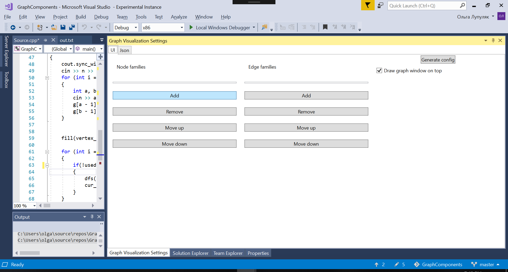

The window with node family settings opens automatically. The default family names are *node#0, node#1* and so on, but you can specify your own.

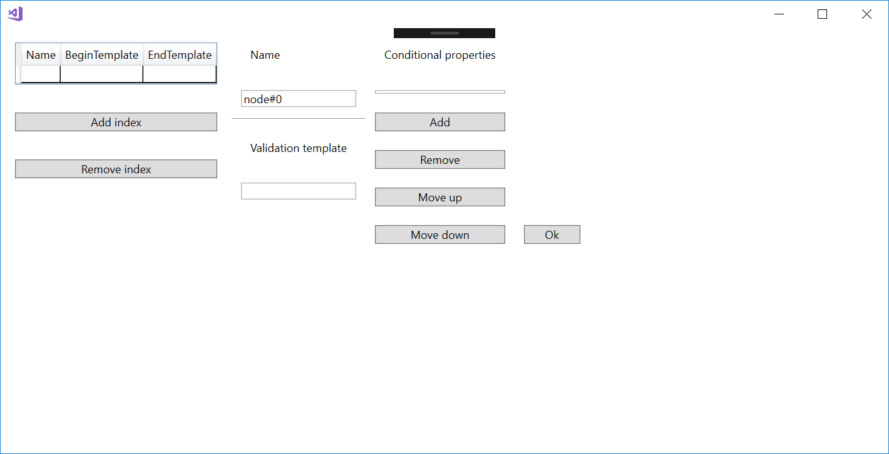

In our example, we have one node family with the name *node#0* and one index in its identifier named *v*. Begin template is `0` and end template is `n`, which equals 10, so the nodes will be `node#0 v 0, node#0 v 1, ..., node#0 v 9`.

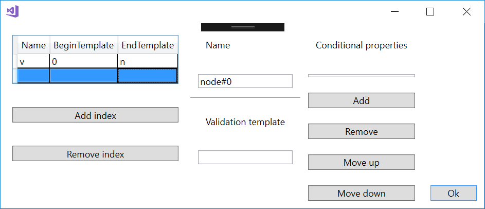

Now let's take a look at the edge family config. First, we will set indices. There is an edge between `a` and `b` if there is `x` such that `g[a][x] == b`.
So, our indices will be `a` and `x`. Note that we use a previous index to define a range of `x`.

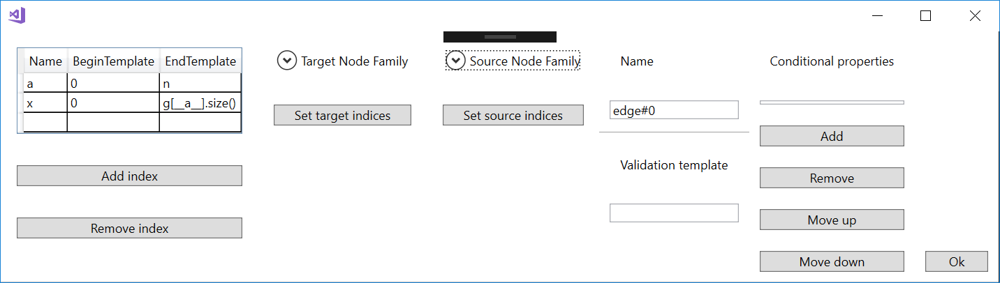

After choosing the family (we have only one option here), we need to set the target and source indices.

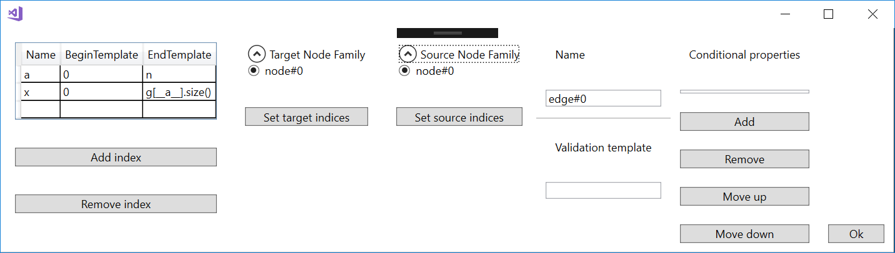

So, we can get the target using this expression.


And the source is the first identifier index.

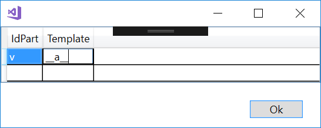

Finally, to avoid duplication of edges, we will specify the validation expression.

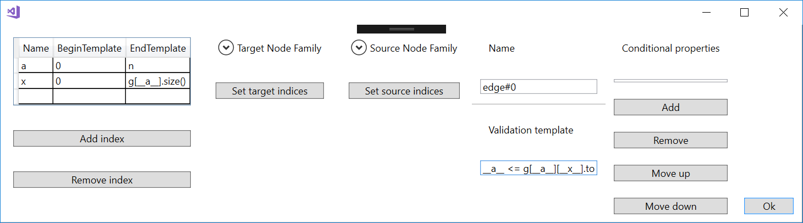


Now, let's generate our config and see how it looks like.

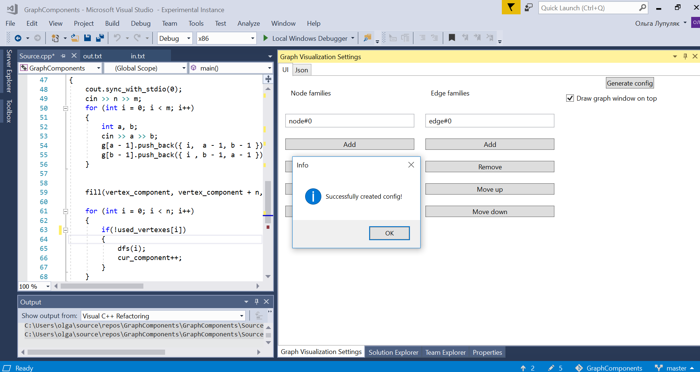

As we can see, the graph is rendered correctly, but the node labels may seem confusing. To avoid it, let's add conditional properties to our config.


To add a conditional property, click *Add* under the list with conditional properties. The label will contain node id, the component id and the number of edges in the component (size).

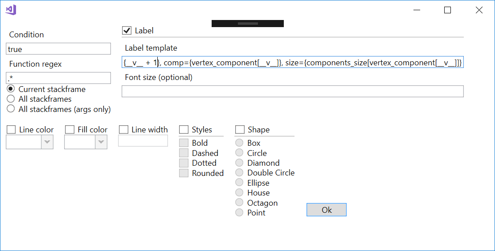

The short description of the condition appears in the list.

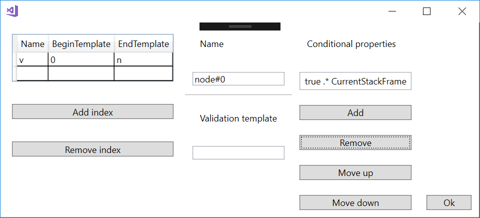

After adding a label to nodes, our picture improved. 

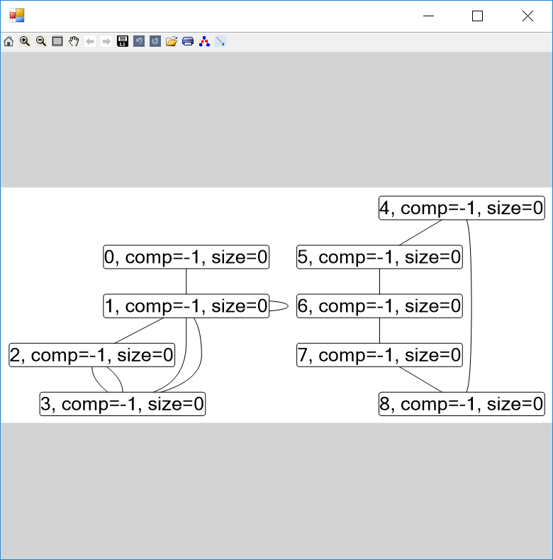

Now let's add other node properties. 

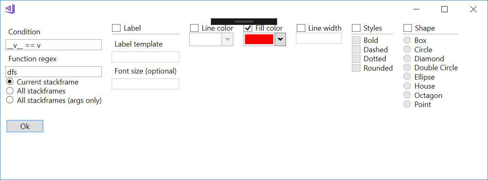

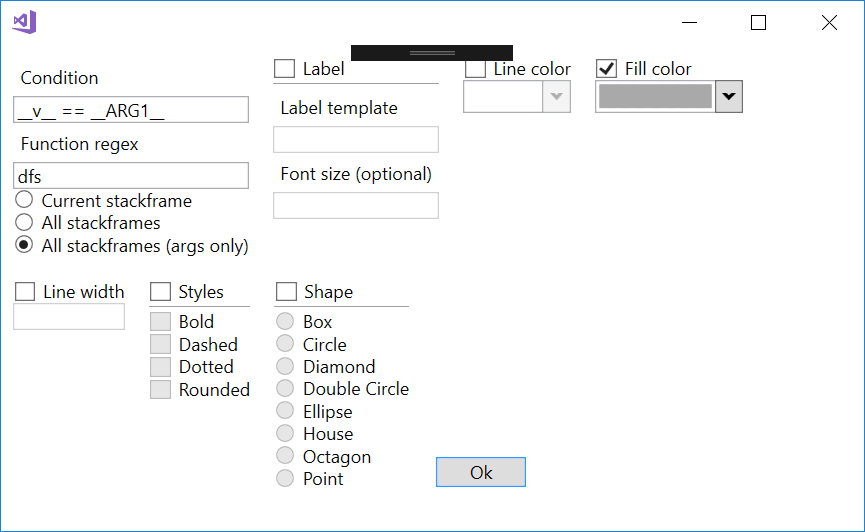

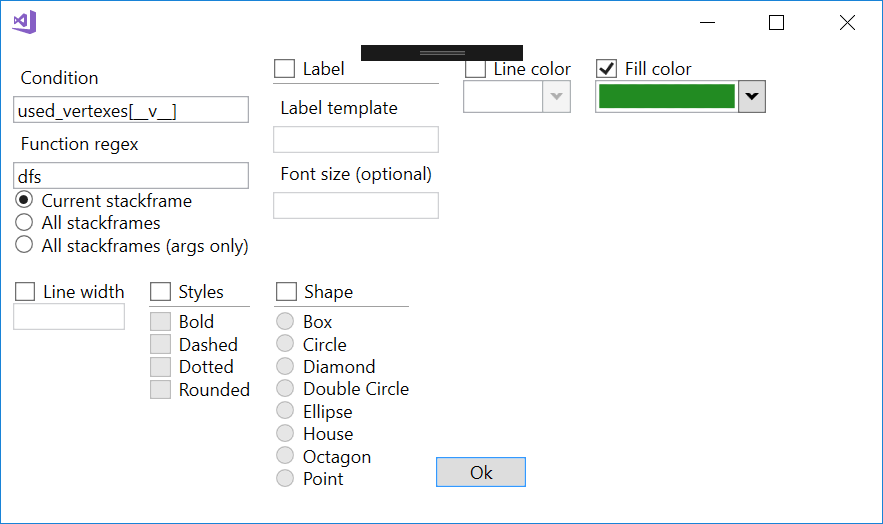

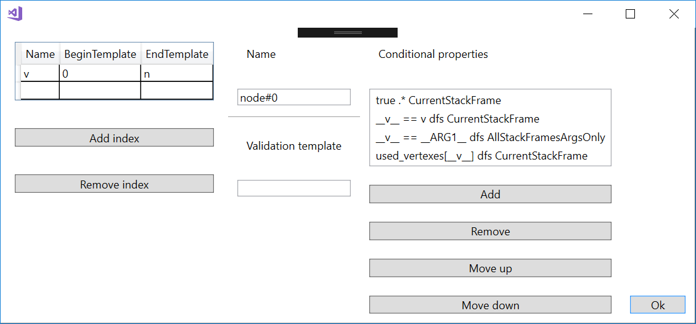

Edge properties...

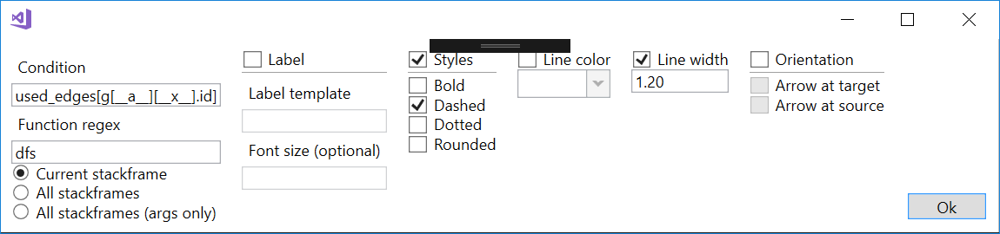

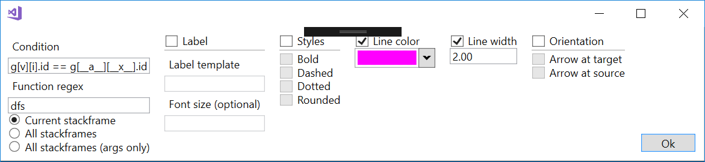


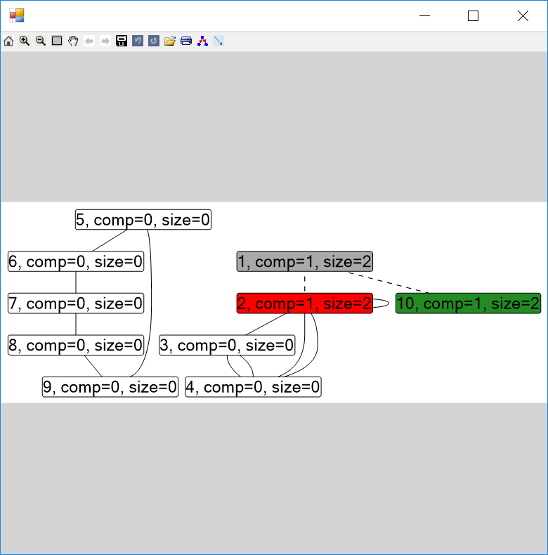


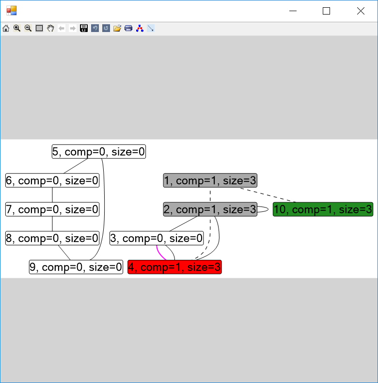

Finally, we can export the generated config in JSON, save it somewhere, and load it next time to avoid creating this config from the beginning. 

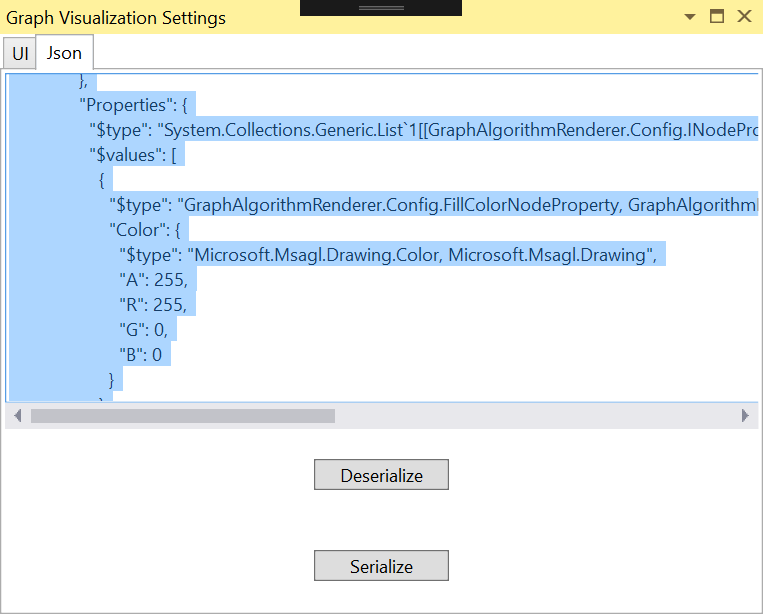

[Here](CONFIG_SAMPLE.md)  is the generated config for this problem.

